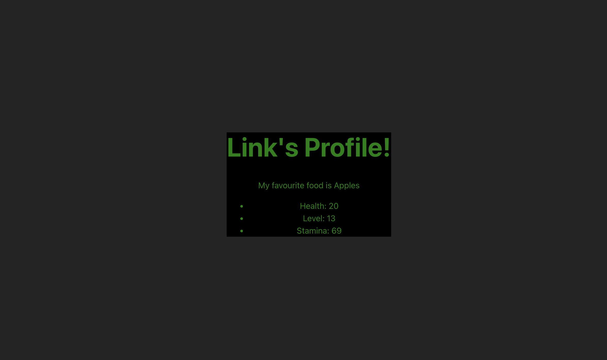

# Markup and Javascript in JSX 🤔

For many years, web developers kept content in HTML, design in CSS, and logic in JavaScript—often in separate files! Content was marked up inside HTML while the page’s logic lived separately in JavaScript.

 React components use a syntax extension called JSX to represent that markup. JSX looks a lot like HTML, but it is a bit stricter and can display dynamic information. 

 ## Passing variables and objects
 kjdlfhgjkdaa

## [TASK] Player Profile
Given the `player` object, display its fields in the following format. Changing the fields inside the player object should change the attributes inside the curly braces (ie. don't hardcode your markup). 

```
{PLAYER NAME}'s profile!
My favourite food is {FOOD}

- Health: {HEALTH}
- Level: {LEVEL}
- Stamina: {STAMINA}
```

Then pass the player's theme into the wrapping div, which should result your text becoming green on a black background. The resulting window



## Calling Functions

## [TASK] Sus Spam
